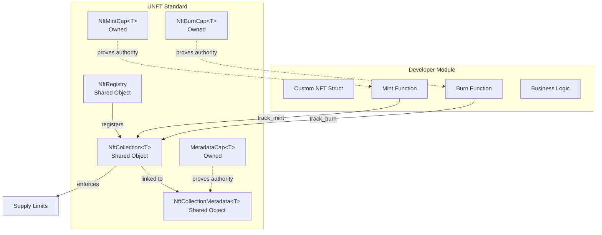
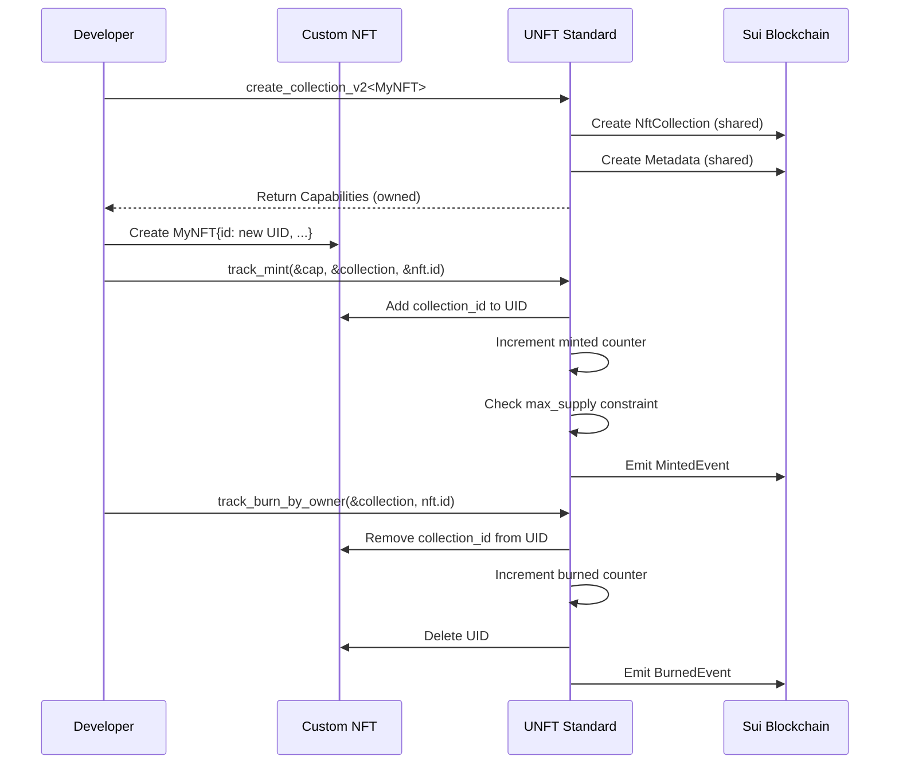

# UNFT Standard

> **Composable NFT Supply Tracking Standard for Sui Move**

A lightweight, type-safe supply tracking layer for Sui NFTs that enforces max supply limits, tracks minting/burning statistics, and enables global NFT collection discovery—without dictating your NFT structure.

## Features

- ✅ **Global Registry Pattern** - One collection per type, discoverable on-chain
- ✅ **Supply Enforcement** - Hard limits on max supply with automatic validation
- ✅ **Dual Burn Models** - BurnCap (centralized) or Owner (decentralized) burning
- ✅ **Gas Optimized** - Batch operations with single event emission
- ✅ **Composable** - Works with any NFT struct, Kiosk, or marketplace
- ✅ **Pausable Collections** - Emergency pause/resume functionality
- ✅ **Metadata Freeze** - Lock metadata permanently when needed

---

## Table of Contents

- [What is UNFT Standard?](#what-is-unft-standard)
- [Simple NFT Example](#simple-nft-example)
- [Quick Start](#quick-start)
- [Core Concepts](#core-concepts)
- [API Reference](#api-reference)
- [Complete Examples](#complete-examples)
- [Architecture](#architecture)
- [Best Practices](#best-practices)
- [Testing](#testing)
- [Security](#security)
- [FAQ](#faq)
- [Development](#development)
- [License](#license)

---

## What is UNFT Standard?

UNFT Standard is a **supply tracking layer**, not a complete NFT implementation. It provides:

### What It IS

- ✅ A global registry for NFT collections by type
- ✅ Enforced supply limits (max_supply)
- ✅ Minted/burned counters with event tracking
- ✅ Metadata management (name, description, image_url)
- ✅ Pausable collections for emergency control

### What It ISN'T

- ❌ NOT a complete NFT struct implementation
- ❌ NOT a marketplace or trading protocol
- ❌ NOT a display standard or metadata schema
- ❌ NOT a replacement for Kiosk or transfer policies

### Design Philosophy

**Composability First**: UNFT Standard integrates with your existing NFT designs rather than forcing a specific structure. You define the NFT struct, we track the supply.

```move
// Your NFT can have any fields you want
public struct GameItem has key, store {
    id: UID,
    power: u64,        // ← Custom field
    rarity: u8,        // ← Custom field
    enchantments: vector<String>,  // ← Custom field
}

// UNFT only needs the UID to track supply
unft::track_mint<GameItem>(&mint_cap, &mut collection, &mut nft.id, ctx);
```

---

## Simple NFT Example

Here's a complete, working NFT contract using UNFT Standard:

```move
module simple_nft::character {
    use std::string::{Self, String};
    use std::option::{Self, Option};
    use sui::object::{Self, UID};
    use sui::package;
    use sui::transfer;
    use unft_standard::unft_standard as unft;

    // ==========================
    // 1. Define Your NFT Struct
    // ==========================
    /// Your custom NFT with any fields you want
    public struct Character has key, store {
        id: UID,
        name: String,
        level: u64,
    }

    // ==========================
    // 2. One-Time Witness (OTW)
    // ==========================
    /// Used to claim Publisher
    public struct CHARACTER has drop {}

    // ==========================
    // 3. Module Initializer
    // ==========================
    /// Runs once when module is published
    fun init(otw: CHARACTER, ctx: &mut TxContext) {
        // Claim publisher using OTW
        let publisher = package::claim(otw, ctx);

        // Transfer publisher to deployer
        transfer::public_transfer(publisher, ctx.sender());

        // Note: UNFT registry is initialized separately by the UNFT Standard module
        // You don't need to initialize it in your module
    }

    // ==========================
    // 4. Create Collection
    // ==========================
    /// Initialize the character collection with UNFT tracking
    public fun create_collection(
        publisher: &package::Publisher,
        registry: &mut unft::NftRegistry,
        ctx: &mut TxContext
    ) {
        let (mint_cap, burn_opt, meta_cap) = unft::create_collection_v2<Character>(
            publisher,
            registry,
            string::utf8(b"Character NFT"),        // name
            string::utf8(b"Game characters"),      // description
            string::utf8(b"https://example.com/character.png"), // image_url
            option::some(string::utf8(b"https://game.com")),    // external_url
            0,                                     // decimals (usually 0 for NFTs)
            option::some(1000),                    // max_supply (1000 characters max)
            false,                                 // pausable (false = cannot pause)
            false,                                 // make_burn_cap (false = owner can burn)
            ctx
        );

        // Transfer capabilities to sender
        transfer::public_transfer(mint_cap, ctx.sender());

        // No burn cap created (owner burn enabled)
        burn_opt.destroy_none();

        transfer::public_transfer(meta_cap, ctx.sender());
    }

    // ==========================
    // 5. Mint Function
    // ==========================
    /// Mint a new character NFT
    public fun mint(
        mint_cap: &unft::NftMintCap<Character>,
        collection: &mut unft::NftCollection<Character>,
        name: String,
        level: u64,
        ctx: &mut TxContext
    ) {
        // Create the NFT UID
        let mut nft_uid = object::new(ctx);

        // Track the mint with UNFT (enforces max_supply, increments counter)
        unft::track_mint<Character>(mint_cap, collection, &mut nft_uid, ctx);

        // Create your custom NFT struct
        let nft = Character {
            id: nft_uid,
            name,
            level,
        };

        // Transfer to sender
        transfer::public_transfer(nft, ctx.sender());
    }

    // ==========================
    // 6. Burn Function
    // ==========================
    /// Burn a character NFT (owner can burn because we didn't create BurnCap)
    public fun burn(
        collection: &mut unft::NftCollection<Character>,
        nft: Character,
        ctx: &TxContext
    ) {
        // Unpack the NFT to get the UID
        let Character { id, name: _, level: _ } = nft;

        // Track the burn with UNFT (increments burned counter)
        unft::track_burn_by_owner<Character>(collection, id, ctx);
    }

    // ==========================
    // 7. Getter Functions
    // ==========================
    /// Get character name
    public fun name(nft: &Character): &String {
        &nft.name
    }

    /// Get character level
    public fun level(nft: &Character): u64 {
        nft.level
    }
}
```

### What This Example Shows

1. **Custom NFT Struct**: Define any fields you want (`name`, `level`)
2. **Collection Creation**: Register with UNFT registry
3. **Supply Tracking**: Automatic enforcement of max_supply (1000)
4. **Mint Function**: Creates NFT and tracks with `track_mint`
5. **Burn Function**: Burns NFT and tracks with `track_burn_by_owner`
6. **Owner Burn Model**: Users can burn their own NFTs (no BurnCap needed)

---

## Quick Start

### Prerequisites

```bash
# Install Sui CLI
cargo install --locked --git https://github.com/MystenLabs/sui.git --branch main sui

# Verify installation
sui --version
```

### Dependencies

Add to your `Move.toml`:

```toml
[dependencies]
Sui = { git = "https://github.com/MystenLabs/sui.git", subdir = "crates/sui-framework/packages/sui-framework", rev = "main" }
unft_standard = { local = "../unft_standard" }
```

### Basic Usage

```move
// 1. Import the module
use unft_standard::unft_standard as unft;
use sui::object;

// 2. Create collection
let (mint_cap, burn_opt, meta_cap) = unft::create_collection_v2<MyNFT>(
    publisher,
    registry,
    name,
    description,
    image_url,
    external_url,
    decimals,
    max_supply,
    pausable,
    make_burn_cap,
    ctx
);

// 3. Mint NFT
let mut nft_uid = object::new(ctx);
unft::track_mint<MyNFT>(&mint_cap, &mut collection, &mut nft_uid, ctx);

// 4. Burn NFT
unft::track_burn_by_owner<MyNFT>(&mut collection, nft_uid, ctx);
```

---

## Core Concepts

### 1. Supply Tracking Layer

UNFT Standard tracks NFT supply without controlling the NFT structure:

```
┌─────────────────────────────────────┐
│  Your Custom NFT Module             │
│  - Defines struct fields            │
│  - Implements business logic        │
│  - Handles transfers/sales          │
└──────────┬──────────────────────────┘
           │
           │ track_mint() / track_burn()
           ▼
┌─────────────────────────────────────┐
│  UNFT Standard                      │
│  - Enforces max_supply              │
│  - Tracks minted/burned counts      │
│  - Emits supply events              │
└─────────────────────────────────────┘
```

**Key Insight**: UNFT only needs the NFT's `UID`. Your NFT can have any structure.

### 2. Global Registry Pattern

Every NFT type registers globally, ensuring discoverability:

```move
// Type T can only have ONE collection
unft::create_collection_v2<GameItem>(...)  // ✅ First registration succeeds

unft::create_collection_v2<GameItem>(...)  // ❌ Second registration aborts
```

Benefits:
- **Uniqueness**: One authoritative collection per type
- **Discoverability**: Anyone can find the collection for type T
- **Type Safety**: Generic parameter T links NFTs to their collection

### 3. Dual Burn Models

Choose the burn model that fits your use case:

#### Owner Burn Model

Users can burn their own NFTs without permission:

```move
// Create collection WITHOUT BurnCap
let (mint_cap, burn_opt, meta_cap) = create_collection_v2<MyNFT>(
    ...,
    make_burn_cap: false,  // ← No BurnCap
    ...
);

// Anyone can burn their own NFT
unft::track_burn_by_owner<MyNFT>(&mut collection, nft_id, ctx);
```

**Use Cases**: Art NFTs, collectibles, general-purpose NFTs

#### BurnCap Model

Only the BurnCap holder can burn NFTs:

```move
// Create collection WITH BurnCap
let (mint_cap, burn_opt, meta_cap) = create_collection_v2<MyNFT>(
    ...,
    make_burn_cap: true,  // ← Create BurnCap
    ...
);

let burn_cap = burn_opt.destroy_some();

// Only BurnCap holder can burn
unft::track_burn<MyNFT>(&burn_cap, &mut collection, nft_id, ctx);
```

**Use Cases**: Game items, subscription tokens, revocable assets

### 4. Composability

UNFT accepts **any UID**, enabling flexible integration:

```move
// Example 1: Simple struct
public struct SimpleNFT has key { id: UID }

// Example 2: Rich metadata
public struct ArtNFT has key, store {
    id: UID,
    artist: address,
    created_at: u64,
    edition: u32,
}

// Example 3: Game item
public struct Weapon has key, store {
    id: UID,
    attack: u64,
    durability: u64,
    enchantments: vector<u8>,
}

// All work with UNFT (examples with type parameters):
unft::track_mint<SimpleNFT>(&cap, &mut collection, &mut nft.id, ctx);
unft::track_mint<ArtNFT>(&cap, &mut collection, &mut nft.id, ctx);
unft::track_mint<Weapon>(&cap, &mut collection, &mut nft.id, ctx);
```

---

## API Reference

### Collection Creation

#### `create_collection_v2<T>`

Creates a new NFT collection with full configuration.

```move
public fun create_collection_v2<T>(
    publisher: &Publisher,
    registry: &mut NftRegistry,
    name: String,
    description: String,
    image_url: String,
    external_url: Option<String>,
    decimals: u8,
    max_supply: Option<u64>,
    pausable: bool,
    make_burn_cap: bool,
    ctx: &mut TxContext
): (NftMintCap<T>, Option<NftBurnCap<T>>, NftCollectionMetadataCap<T>)
```

**Parameters:**
- `publisher`: Proof of authority for type T (from `package::claim`)
- `registry`: Global registry (shared object)
- `name`: Collection name (e.g., "CryptoPunks")
- `description`: Collection description
- `image_url`: Collection image (must be non-empty string, URL format recommended but not validated on-chain)
- `external_url`: Optional website URL
- `decimals`: Usually `0` for NFTs (for future fractional support)
- `max_supply`: `Some(n)` for limited, `None` for unlimited
- `pausable`: If `true`, collection can be paused/resumed
- `make_burn_cap`: If `true`, creates BurnCap; if `false`, enables owner burn

> **⚠️ IMPORTANT: Dual Supply Semantics**
>
> UNFT Standard has **two** supply-related fields with different enforcement:
>
> 1. **`max_supply`** (in `NftCollection<T>`) - **HARD ON-CHAIN ENFORCEMENT**
>    - Cryptographic guarantee enforced by contract
>    - Aborts minting if exceeded (`EMaxSupplyExceeded`)
>    - Set at collection creation, cannot be changed (except via `finalize_supply()`)
>    - Use this for: Legal guarantees, scarcity promises, tokenomics
>
> 2. **`max_supply_hint`** (in `NftCollectionMetadata<T>`) - **SOFT UI HINT ONLY**
>    - Display-only field for wallets/explorers
>    - NOT enforced on-chain
>    - Can be updated anytime via `update_metadata()`
>    - Use this for: Marketing targets, staged releases, flexible campaigns
>
> **Example Use Case:**
> ```move
> // Guarantee never more than 10,000 NFTs (enforced)
> max_supply: Some(10000),
>
> // Display "Limited Edition: First 1000" in UI (not enforced)
> max_supply_hint: Some(1000),
> ```
>
> When creating a collection via `create_collection_v2()`, the `max_supply` parameter is used for **both** fields initially. Update `max_supply_hint` separately via `update_metadata()` if needed.

**Returns:**
- `NftMintCap<T>`: Capability to mint NFTs
- `Option<NftBurnCap<T>>`: BurnCap if `make_burn_cap=true`, otherwise `None`
- `NftCollectionMetadataCap<T>`: Capability to update metadata

**Example:**

```move
let (mint_cap, burn_opt, meta_cap) = unft::create_collection_v2<GameItem>(
    &publisher,
    &mut registry,
    string::utf8(b"Epic Weapons"),
    string::utf8(b"Legendary weapons for warriors"),
    string::utf8(b"https://cdn.game.com/weapons.png"),
    option::some(string::utf8(b"https://game.com/weapons")),
    0,
    option::some(5000),  // Max 5000 weapons
    true,                // Pausable
    false,               // No BurnCap (owner burn)
    ctx
);
```

#### `create_unlimited_collection_v2<T>`

Shorthand for creating unlimited supply collections.

```move
public fun create_unlimited_collection_v2<T>(
    publisher: &Publisher,
    registry: &mut NftRegistry,
    name: String,
    description: String,
    image_url: String,
    external_url: Option<String>,
    decimals: u8,
    pausable: bool,
    make_burn_cap: bool,
    ctx: &mut TxContext
): (NftMintCap<T>, Option<NftBurnCap<T>>, NftCollectionMetadataCap<T>)
```

**Note:** Equivalent to calling `create_collection_v2` with `max_supply = None`.

---

### Events

Standardized events emitted for indexing and analytics:

- `MintedEvent<T>`: Single mint recorded via `track_mint`
- `BatchMintedEvent<T>`: Batch mint recorded via `track_batch_mint`
- `BurnedEvent<T>`: Burn recorded via `track_burn` or `track_burn_by_owner`
- `MetadataUpdatedEvent<T>`: Metadata changed via `update_metadata` (includes changed-fields bitmask)
- `MetadataFrozenEvent<T>`: Metadata permanently frozen via `freeze_metadata`
- `CollectionPausedEvent<T>` / `CollectionResumedEvent<T>`: Pause state changes
- `SupplyFinalizedEvent<T>`: Supply locked via `finalize_supply`
- `CapsInitializedEvent<T>`: Cap IDs emitted on collection creation
- `CollectionRegisteredEvent<T>`: Collection registered in the global registry

### Minting Tracking

#### `track_mint<T>`

Tracks a single NFT mint.

```move
public fun track_mint<T>(
    _mint: &NftMintCap<T>,
    col: &mut NftCollection<T>,
    nft: &mut UID,
    ctx: &TxContext
)
```

**Parameters:**
- `_mint`: Proof of minting authority (underscore = unused but enforces type safety)
- `col`: The collection to track against
- `nft`: The NFT's UID (from your custom struct)
- `ctx`: Transaction context

**Effects:**
- ✅ Increments `minted` counter
- ✅ Adds `collection_id` dynamic field to NFT's UID
- ✅ Emits `MintedEvent`
- ✅ Enforces `max_supply` (aborts if exceeded)
- ✅ Enforces `!paused` (aborts if paused)

**Example:**

```move
let mut nft_uid = object::new(ctx);
unft::track_mint<MyNFT>(&mint_cap, &mut collection, &mut nft_uid, ctx);

let nft = MyNFT { id: nft_uid, /* other fields */ };
```

#### `track_batch_mint<T>`

Tracks multiple NFT mints in one transaction (gas optimized).

```move
public fun track_batch_mint<T>(
    _mint: &NftMintCap<T>,
    col: &mut NftCollection<T>,
    nfts: &mut vector<UID>,
    ctx: &TxContext
)
```

**Benefits:**
- ✅ Single `BatchMintedEvent` instead of N events
- ✅ Reduced gas cost for large batches
- ✅ Early return if vector is empty (no-op)

**Example:**

```move
// First, create NFT UIDs
let mut uids = vector::empty<UID>();
let mut i = 0;
while (i < 100) {
    let uid = object::new(ctx);
    vector::push_back(&mut uids, uid);
    i = i + 1;
};

// Track all mints in one batch (gas optimized)
unft::track_batch_mint<MyNFT>(&mint_cap, &mut collection, &mut uids, ctx);

// Now create actual NFT structs from the UIDs
// Note: You'll need to extract UIDs from the vector to use them
```

---

### Burning Tracking

#### `track_burn<T>`

Tracks NFT burn using BurnCap (centralized model).

```move
public fun track_burn<T>(
    _cap: &NftBurnCap<T>,
    col: &mut NftCollection<T>,
    mut nft_uid: UID,
    ctx: &TxContext
)
```

**Requirements:**
- Must have `NftBurnCap<T>`
- NFT's `collection_id` must match the collection

Note: If the collection was created without a BurnCap (`make_burn_cap = false`), centralized burns are not possible because no `NftBurnCap<T>` exists. Use `track_burn_by_owner` instead.

**Effects:**
- ✅ Increments `burned` counter
- ✅ Removes `collection_id` dynamic field
- ✅ Deletes the UID
- ✅ Emits `BurnedEvent`

**Example:**

```move
public fun burn_weapon(
    burn_cap: &NftBurnCap<Weapon>,
    collection: &mut NftCollection<Weapon>,
    weapon: Weapon,
    ctx: &TxContext
) {
    let Weapon { id, attack: _, durability: _ } = weapon;
    unft::track_burn<Weapon>(burn_cap, collection, id, ctx);
}
```

#### `track_burn_by_owner<T>`

Tracks NFT burn by owner (decentralized model).

```move
public fun track_burn_by_owner<T>(
    col: &mut NftCollection<T>,
    mut nft_uid: UID,
    ctx: &TxContext
)
```

**Requirements:**
- Collection must have `owner_burn_allowed = true` (set when `make_burn_cap = false`)
- NFT's `collection_id` must match

**Example:**

```move
public fun burn_my_nft(
    collection: &mut NftCollection<MyNFT>,
    nft: MyNFT,
    ctx: &TxContext
) {
    let MyNFT { id, /* other fields */ } = nft;
    unft::track_burn_by_owner<MyNFT>(collection, id, ctx);
}
```

---

### Metadata Management

#### `update_metadata<T>`

Updates collection metadata (name, description, image_url, external_url, decimals, max_supply_hint).

```move
public fun update_metadata<T>(
    _cap: &NftCollectionMetadataCap<T>,
    md: &mut NftCollectionMetadata<T>,
    name: Option<String>,
    description: Option<String>,
    image_url: Option<String>,
    external_url: Option<Option<String>>,
    decimals: Option<u8>,
    max_supply_hint: Option<Option<u64>>,
    ctx: &TxContext
)
```

**Notes:**
- All parameters are `Option` - pass `None` to keep current value
- `external_url` is `Option<Option<String>>`:
  - `None` = no change
  - `Some(None)` = clear URL
  - `Some(Some(url))` = set new URL
- Aborts if metadata is frozen
- URLs must be non-empty strings

**Example:**

```move
// Update only name and description
unft::update_metadata(
    &meta_cap,
    &mut metadata,
    option::some(string::utf8(b"New Name")),
    option::some(string::utf8(b"New Description")),
    option::none(),  // Keep image_url
    option::none(),  // Keep external_url
    option::none(),  // Keep decimals
    option::none(),  // Keep max_supply_hint
    ctx
);
```

#### `freeze_metadata<T>`

Permanently freezes metadata, preventing all future updates.

```move
public fun freeze_metadata<T>(
    cap: NftCollectionMetadataCap<T>,
    md: &mut NftCollectionMetadata<T>,
    ctx: &TxContext
)
```

**Effects:**
- ✅ Sets `metadata_frozen = true`
- ✅ **Destroys** the `MetadataCap` (irreversible!)
- ✅ Emits `MetadataFrozenEvent`

**⚠️ Warning:** This is irreversible. Once frozen, metadata cannot be updated ever again.

---

### Supply Queries

#### `supply<T>`

Returns full supply information as a tuple.

```move
public fun supply<T>(col: &NftCollection<T>): (u64, u64, Option<u64>)
```

**Returns:** `(minted, burned, max_supply)`

**Example:**

```move
let (minted, burned, max_supply) = unft::supply(&collection);
let circulating = minted - burned;
```

#### Individual Field Getters

```move
public fun minted<T>(col: &NftCollection<T>): u64
public fun burned<T>(col: &NftCollection<T>): u64
public fun max_supply<T>(col: &NftCollection<T>): Option<u64>
```

**Example:**

```move
let total_minted = unft::minted(&collection);
```

#### `can_mint<T>`

Checks if minting `amount` NFTs is allowed.

```move
public fun can_mint<T>(col: &NftCollection<T>, amount: u64): bool
```

**Checks:**
- ✅ `amount > 0`
- ✅ `!col.paused`
- ✅ `col.minted + amount <= max_supply` (if max_supply exists)

**Example:**

```move
if (unft::can_mint(&collection, 10)) {
    // Proceed with batch mint
} else {
    // Handle limit reached
}
```

#### `remaining_supply<T>`

Returns remaining mintable quantity.

```move
public fun remaining_supply<T>(col: &NftCollection<T>): Option<u64>
```

**Returns:**
- `None` if unlimited supply
- `Some(0)` if sold out
- `Some(n)` if n NFTs remaining

**Example:**

```move
match (unft::remaining_supply(&collection)) {
    Some(0) => abort ESoldOut,
    Some(remaining) => assert!(amount <= remaining, EExceedsRemaining),
    None => {} // Unlimited supply
}
```

#### `finalize_supply<T>`

Locks unlimited collection to current supply (irreversible).

```move
public fun finalize_supply<T>(
    mint: NftMintCap<T>,
    col: &mut NftCollection<T>,
    ctx: &TxContext
)
```

**Requirements:**
- Collection must have `max_supply = None` (unlimited)
- Must have minted at least 1 NFT

**Effects:**
- ✅ Sets `max_supply = Some(current_minted)`
- ✅ **Destroys** the `MintCap` (no more minting!)
- ✅ Emits `SupplyFinalizedEvent`

**Use Case:** Limited edition drops where final supply is determined after minting ends.

---

### Collection State

#### `pause_collection<T>`

Pauses minting (emergency control).

```move
public fun pause_collection<T>(
    _cap: &NftCollectionMetadataCap<T>,
    metadata: &NftCollectionMetadata<T>,
    col: &mut NftCollection<T>,
    ctx: &TxContext
)
```

**Requirements:**
- Collection must be `pausable = true`

**Effects:**
- ✅ Sets `col.paused = true`
- ✅ Blocks all `track_mint` calls
- ✅ Idempotent (safe to call multiple times)

#### `resume_collection<T>`

Resumes minting after pause.

```move
public fun resume_collection<T>(
    _cap: &NftCollectionMetadataCap<T>,
    metadata: &NftCollectionMetadata<T>,
    col: &mut NftCollection<T>,
    ctx: &TxContext
)
```

**Getters:**

```move
public fun is_paused<T>(col: &NftCollection<T>): bool
public fun allows_owner_burn<T>(col: &NftCollection<T>): bool
```

---

### NFT Discovery

#### `nft_collection_id`

Gets the collection ID from an NFT's UID (aborts if not found).

```move
public fun nft_collection_id(nft: &UID): object::ID
```

**Aborts:** If NFT doesn't have `collection_id` field (not registered with UNFT)

#### `try_nft_collection_id`

Safe version that returns `Option` instead of aborting.

```move
public fun try_nft_collection_id(nft: &UID): Option<object::ID>
```

**Returns:** `Some(id)` if found, `None` otherwise

#### `nft_collection_id_or`

Gets collection ID with fallback.

```move
public fun nft_collection_id_or(nft: &UID, default: object::ID): object::ID
```

**Returns:** Collection ID if found, otherwise `default`

#### `has_collection_id`

Checks if NFT has collection ID.

```move
public fun has_collection_id(nft: &UID): bool
```

#### `nft_collection_ids`

Batch get collection IDs from multiple NFTs.

```move
public fun nft_collection_ids(nfts: &vector<UID>): vector<object::ID>
```

**Note:** Aborts if any NFT is missing collection_id. Check with `has_collection_id` first if unsure.

---

### Registry Operations

#### `collection_exists<T>`

Checks if type T has registered collection.

```move
public fun collection_exists<T>(reg: &NftRegistry): bool
```

#### `get_locator<T>`

Gets collection and metadata IDs for type T.

```move
public fun get_locator<T>(reg: &NftRegistry): CollectionLocator
```

**Returns:** `CollectionLocator` with `collection_id` and `metadata_id`

**Access IDs:**

```move
let locator = unft::get_locator<MyNFT>(&registry);
let collection_id = unft::locator_collection_id(locator);
let metadata_id = unft::locator_metadata_id(locator);
```

---

### Metadata Getters

Direct field accessors for `NftCollectionMetadata<T>`:

```move
public fun name<T>(md: &NftCollectionMetadata<T>): &String
public fun description<T>(md: &NftCollectionMetadata<T>): &String
public fun image_url<T>(md: &NftCollectionMetadata<T>): &String
public fun external_url<T>(md: &NftCollectionMetadata<T>): &Option<String>
public fun decimals<T>(md: &NftCollectionMetadata<T>): u8
public fun metadata_frozen<T>(md: &NftCollectionMetadata<T>): bool
public fun version<T>(md: &NftCollectionMetadata<T>): u8
```

---

## Error Codes

UNFT Standard uses descriptive error codes to help debug issues. All errors are defined with the `#[error]` attribute in Move 2024.

### Collection Management Errors

**`ENotAuthorizedPublisher`**
- **Trigger**: Attempting to create a collection without proper Publisher proof
- **Fix**: Ensure you're using the correct Publisher obtained from the One-Time Witness

**`EAlreadyRegistered`**
- **Trigger**: Attempting to register a collection for a type that already has one
- **Fix**: Each type can only have one collection. Check if collection exists with `collection_exists<T>()`

**`ENotRegistered`**
- **Trigger**: Attempting to retrieve a collection locator for an unregistered type
- **Fix**: Create the collection first using `create_collection_v2<T>()`

### Supply Errors

**`EMaxSupplyExceeded`**
- **Trigger**: Minting would exceed the collection's `max_supply` limit
- **Fix**: Check `remaining_supply<T>()` before minting, or increase max_supply (not possible after creation)

**`EInvalidMintAmount`**
- **Trigger**: Attempting to mint with quantity = 0
- **Fix**: Ensure mint quantity is greater than 0

**`ECannotFinalizeZeroSupply`**
- **Trigger**: Calling `finalize_supply()` on a collection with 0 minted NFTs
- **Fix**: Mint at least 1 NFT before finalizing supply

**`EAlreadyFixedSupply`**
- **Trigger**: Calling `finalize_supply()` on a collection that already has a fixed `max_supply`
- **Fix**: Only call `finalize_supply()` on unlimited collections (max_supply = None)

### Burn Errors

**`EOwnerBurnDisabled`**
- **Trigger**: Calling `track_burn_by_owner()` on a collection with `owner_burn_allowed = false`
- **Fix**: Use `track_burn()` with the BurnCap instead, or create collection with `make_burn_cap = false`

### Metadata Errors

**`EInvalidImageUrl`**
- **Trigger**: Providing an empty string for `image_url` when creating/updating collection
- **Fix**: Ensure `image_url` is a non-empty string (URL format recommended)

**`EInvalidExternalUrl`**
- **Trigger**: Providing an empty string for `external_url` when updating metadata
- **Fix**: Use `None` to clear URL, or provide non-empty string

**`EMetadataFrozen`**
- **Trigger**: Attempting to update metadata after calling `freeze_metadata()`
- **Fix**: Metadata cannot be updated after freezing (irreversible)

**`EMetadataCollectionMismatch`**
- **Trigger**: NFT's `collection_id` doesn't match the collection being operated on
- **Fix**: Ensure you're using the correct collection object for the NFT type

### Pause Errors

**`ECollectionPaused`**
- **Trigger**: Attempting to mint when collection is paused
- **Fix**: Resume collection with `resume_collection()` or wait for admin to resume

**`ECollectionNotPausable`**
- **Trigger**: Attempting to pause a collection created with `pausable = false`
- **Fix**: Pausable flag is set at creation and cannot be changed

### Discovery Errors

**`ECollectionIdNotFound`**
- **Trigger**: Calling `nft_collection_id()` on a UID that wasn't registered with UNFT
- **Fix**: Use `try_nft_collection_id()` for safe access, or ensure `track_mint()` was called

---

## Complete Examples

### Example 1: Game Item NFT with Durability

```move
module game::weapon {
    use std::string::{Self, String};
    use std::option;
    use sui::object::{Self, UID};
    use sui::package;
    use sui::transfer;
    use unft_standard::unft_standard as unft;

    public struct Weapon has key, store {
        id: UID,
        name: String,
        attack: u64,
        durability: u64,  // Decreases with use
    }

    public struct WEAPON has drop {}

    fun init(otw: WEAPON, ctx: &mut TxContext) {
        let publisher = package::claim(otw, ctx);
        transfer::public_transfer(publisher, ctx.sender());
    }

    public fun create_collection(
        publisher: &package::Publisher,
        registry: &mut unft::NftRegistry,
        ctx: &mut TxContext
    ) {
        let (mint_cap, burn_opt, meta_cap) = unft::create_collection_v2<Weapon>(
            publisher,
            registry,
            string::utf8(b"Epic Weapons"),
            string::utf8(b"Legendary weapons that can break"),
            string::utf8(b"https://game.com/weapons.png"),
            option::some(string::utf8(b"https://game.com")),
            0,
            option::some(10000),  // Max 10k weapons
            false,                // Not pausable
            true,                 // Create BurnCap (weapons can be destroyed by game)
            ctx
        );

        transfer::public_transfer(mint_cap, ctx.sender());
        transfer::public_transfer(burn_opt.destroy_some(), ctx.sender());
        transfer::public_transfer(meta_cap, ctx.sender());
    }

    public fun mint_weapon(
        mint_cap: &unft::NftMintCap<Weapon>,
        collection: &mut unft::NftCollection<Weapon>,
        name: String,
        attack: u64,
        ctx: &mut TxContext
    ): Weapon {
        let mut nft_uid = object::new(ctx);
        unft::track_mint<Weapon>(mint_cap, collection, &mut nft_uid, ctx);

        Weapon {
            id: nft_uid,
            name,
            attack,
            durability: 100,  // Start with full durability
        }
    }

    /// Use weapon (decreases durability)
    public fun use_weapon(weapon: &mut Weapon): u64 {
        assert!(weapon.durability > 0, EWeaponBroken);
        weapon.durability = weapon.durability - 1;
        weapon.attack
    }

    /// Weapon breaks when durability reaches 0
    public fun destroy_broken_weapon(
        burn_cap: &unft::NftBurnCap<Weapon>,
        collection: &mut unft::NftCollection<Weapon>,
        weapon: Weapon,
        ctx: &TxContext
    ) {
        assert!(weapon.durability == 0, EWeaponNotBroken);

        let Weapon { id, name: _, attack: _, durability: _ } = weapon;
        unft::track_burn<Weapon>(burn_cap, collection, id, ctx);
    }

    const EWeaponBroken: u64 = 0;
    const EWeaponNotBroken: u64 = 1;
}
```

---

### Example 2: Limited Edition Art with Supply Finalization

```move
module art::limited_edition {
    use std::string::{Self, String};
    use std::option;
    use sui::object::{Self, UID};
    use sui::package;
    use sui::transfer;
    use unft_standard::unft_standard as unft;

    public struct ArtPiece has key, store {
        id: UID,
        artist: address,
        edition: u32,
        created_at: u64,
    }

    public struct LIMITED_EDITION has drop {}

    fun init(otw: LIMITED_EDITION, ctx: &mut TxContext) {
        let publisher = package::claim(otw, ctx);
        transfer::public_transfer(publisher, ctx.sender());
    }

    public fun create_collection(
        publisher: &package::Publisher,
        registry: &mut unft::NftRegistry,
        ctx: &mut TxContext
    ) {
        // Start with UNLIMITED supply
        let (mint_cap, burn_opt, meta_cap) = unft::create_unlimited_collection_v2<ArtPiece>(
            publisher,
            registry,
            string::utf8(b"Limited Edition Art"),
            string::utf8(b"Exclusive art pieces by renowned artists"),
            string::utf8(b"https://art.gallery/collection.png"),
            option::some(string::utf8(b"https://art.gallery")),
            0,
            false,  // Not pausable
            false,  // Owner burn (collectors can burn their art)
            ctx
        );

        transfer::public_transfer(mint_cap, ctx.sender());
        burn_opt.destroy_none();
        transfer::public_transfer(meta_cap, ctx.sender());
    }

    /// Mint art piece with edition number
    public fun mint_art(
        mint_cap: &unft::NftMintCap<ArtPiece>,
        collection: &mut unft::NftCollection<ArtPiece>,
        artist: address,
        clock: &sui::clock::Clock,
        ctx: &mut TxContext
    ): ArtPiece {
        let mut nft_uid = object::new(ctx);
        unft::track_mint<ArtPiece>(mint_cap, collection, &mut nft_uid, ctx);

        let edition = unft::minted<ArtPiece>(collection);  // Use minted count as edition number

        ArtPiece {
            id: nft_uid,
            artist,
            edition: (edition as u32),
            created_at: sui::clock::timestamp_ms(clock),
        }
    }

    /// Finalize the edition (locks supply to current count)
    public fun finalize_edition(
        mint_cap: unft::NftMintCap<ArtPiece>,
        collection: &mut unft::NftCollection<ArtPiece>,
        ctx: &mut TxContext
    ) {
        // Get current supply
        let final_supply = unft::minted<ArtPiece>(collection);

        // Finalize supply (consumes mint_cap)
        unft::finalize_supply<ArtPiece>(mint_cap, collection, ctx);

        // Now max_supply = Some(final_supply) and no more minting possible
    }

    /// Burn art piece (owner decision)
    public fun burn_art(
        collection: &mut unft::NftCollection<ArtPiece>,
        art: ArtPiece,
        ctx: &TxContext
    ) {
        let ArtPiece { id, artist: _, edition: _, created_at: _ } = art;
        unft::track_burn_by_owner<ArtPiece>(collection, id, ctx);
    }
}
```

---

### Example 3: Kiosk Integration

```move
module marketplace::kiosk_nft {
    use std::string::{Self, String};
    use std::option;
    use sui::object::{Self, UID};
    use sui::package;
    use sui::transfer;
    use sui::kiosk::{Self, Kiosk, KioskOwnerCap};
    use sui::transfer_policy::{Self, TransferPolicy};
    use unft_standard::unft_standard as unft;

    public struct CollectibleItem has key, store {
        id: UID,
        name: String,
        rarity: u8,
    }

    public struct KIOSK_NFT has drop {}

    fun init(otw: KIOSK_NFT, ctx: &mut TxContext) {
        let publisher = package::claim(otw, ctx);
        transfer::public_transfer(publisher, ctx.sender());
    }

    public fun create_collection(
        publisher: &package::Publisher,
        registry: &mut unft::NftRegistry,
        ctx: &mut TxContext
    ) {
        let (mint_cap, burn_opt, meta_cap) = unft::create_collection_v2<CollectibleItem>(
            publisher,
            registry,
            string::utf8(b"Collectibles"),
            string::utf8(b"Rare collectible items"),
            string::utf8(b"https://marketplace.com/collectibles.png"),
            option::none(),
            0,
            option::some(5000),
            false,
            false,  // Owner burn
            ctx
        );

        transfer::public_transfer(mint_cap, ctx.sender());
        burn_opt.destroy_none();
        transfer::public_transfer(meta_cap, ctx.sender());
    }

    /// Mint directly into a Kiosk
    public fun mint_to_kiosk(
        mint_cap: &unft::NftMintCap<CollectibleItem>,
        collection: &mut unft::NftCollection<CollectibleItem>,
        kiosk: &mut Kiosk,
        kiosk_cap: &KioskOwnerCap,
        name: String,
        rarity: u8,
        ctx: &mut TxContext
    ) {
        // Create NFT
        let mut nft_uid = object::new(ctx);
        unft::track_mint<CollectibleItem>(mint_cap, collection, &mut nft_uid, ctx);

        let nft = CollectibleItem {
            id: nft_uid,
            name,
            rarity,
        };

        // Place in kiosk
        kiosk::place(kiosk, kiosk_cap, nft);
    }

    /// Take from kiosk and burn
    public fun burn_from_kiosk(
        collection: &mut unft::NftCollection<CollectibleItem>,
        kiosk: &mut Kiosk,
        kiosk_cap: &KioskOwnerCap,
        nft_id: object::ID,
        ctx: &TxContext
    ) {
        // Take from kiosk
        let nft: CollectibleItem = kiosk::take(kiosk, kiosk_cap, nft_id);

        // Burn
        let CollectibleItem { id, name: _, rarity: _ } = nft;
        unft::track_burn_by_owner<CollectibleItem>(collection, id, ctx);
    }

    /// List item in kiosk (UNFT doesn't interfere with Kiosk operations)
    public fun list_in_kiosk(
        kiosk: &mut Kiosk,
        kiosk_cap: &KioskOwnerCap,
        nft_id: object::ID,
        price: u64,
        ctx: &mut TxContext
    ) {
        kiosk::list<CollectibleItem>(kiosk, kiosk_cap, nft_id, price);
    }
}
```

---

## Architecture

### System Architecture



### Data Flow



### Dynamic Field Safety: CollectionIdKey

UNFT Standard uses a **typed dynamic field key** to prevent cross-module conflicts when storing collection IDs on NFT UIDs:

```move
/// Key type for collection_id dynamic field to prevent cross-module conflicts.
public struct CollectionIdKey() has copy, drop, store;
```

**Why This Matters:**

Without a typed key, any module could accidentally or maliciously:
- ❌ Overwrite UNFT's `collection_id` field
- ❌ Create conflicts with identically-named fields
- ❌ Corrupt supply tracking data

**How It Works:**

```move
// UNFT adds collection_id using typed key
dynamic_field::add<CollectionIdKey>(&mut nft.id, CollectionIdKey(), collection_id);

// Other modules can't access this field without the exact CollectionIdKey type
// Even if they try to add a field with name "collection_id", it won't conflict
```

**Security Benefits:**
- ✅ Type-safe isolation (only UNFT Standard can access this field)
- ✅ Prevents namespace collisions with other standards
- ✅ Enables UNFT to coexist with other NFT tracking systems

**Move 2024 Note:** The positional struct syntax `CollectionIdKey()` (instead of `CollectionIdKey {}`) is used for compliance with Move 2024's zero-field struct requirements.

---

### Component Relationships

**Shared Objects** (accessible by anyone):
- `NftRegistry` - Global singleton
- `NftCollection<T>` - One per type T
- `NftCollectionMetadata<T>` - One per type T

**Owned Objects** (capabilities):
- `NftMintCap<T>` - Proves minting authority
- `NftBurnCap<T>` - Proves burning authority (optional)
- `NftCollectionMetadataCap<T>` - Proves metadata update authority

**Type Parameter Enforcement:**

```move
// Generic T links everything together
unft::track_mint<MyNFT>(
    _mint: &NftMintCap<MyNFT>,      // ← Same T
    col: &mut NftCollection<MyNFT>, // ← Same T
    nft: &mut UID,                  // ← Will be linked to MyNFT's collection
    ctx: &TxContext
)
```

The type system ensures you cannot:
- ❌ Use `MintCap<TypeA>` with `Collection<TypeB>`
- ❌ Mix collections from different types
- ❌ Register same type twice

---

## Best Practices

### 1. Choosing Burn Model

**Use BurnCap Model When:**
- ✅ You need centralized control (game items, subscriptions)
- ✅ NFTs represent revocable privileges
- ✅ Compliance requires admin burn capability

**Use Owner Burn Model When:**
- ✅ NFTs are purely collectible (art, PFPs)
- ✅ Decentralization is a core value
- ✅ Users should control their assets fully

**Decision Tree:**

```
Does your NFT represent a revocable right or game asset?
├─ Yes → Use BurnCap (set make_burn_cap = true)
└─ No  → Use Owner Burn (set make_burn_cap = false)
```

### 2. Supply Management

**Fixed Supply vs Unlimited:**

```move
// Fixed supply (e.g., 10,000 NFTs)
option::some(10000)

// Unlimited supply (mint on demand)
option::none()
```

**When to Use `finalize_supply`:**

```move
// Scenario: Dynamic edition size
// 1. Start with unlimited
create_unlimited_collection_v2<MyNFT>(...);

// 2. Mint during sale period
while (sale_active) {
    mint(...);
}

// 3. Lock to final edition size
finalize_supply<MyNFT>(mint_cap, collection, ctx);
// Now max_supply = current minted count
```

**Displaying Remaining Supply:**

```move
public fun get_mint_info(col: &NftCollection<MyNFT>): (u64, Option<u64>) {
    let minted = unft::minted<MyNFT>(col);
    let remaining = unft::remaining_supply<MyNFT>(col);
    (minted, remaining)
}

// In UI:
// "Minted: 1,234 / 10,000"
// "Remaining: 8,766"
```

### 3. Metadata Management

**When to Freeze Metadata:**

```move
// Freeze when collection is finalized and metadata is immutable
// Example: Art collection with guaranteed image permanence

freeze_metadata<MyNFT>(meta_cap, metadata, ctx);
// ⚠️ Irreversible! No more updates possible
```

**URL Validation:**

```move
// ✅ Good: Use IPFS or permanent storage
"ipfs://QmXyz..."
"https://arweave.net/abc..."

// ⚠️ Risky: Centralized servers (can change/break)
"https://myserver.com/nft.png"
```

**Update Patterns:**

```move
// Update only what changed
update_metadata<MyNFT>(
    &cap,
    &mut metadata,
    option::some(new_name),      // Update name
    option::none(),              // Keep description
    option::none(),              // Keep image
    option::none(),              // Keep external_url
    option::none(),              // Keep decimals
    option::none(),              // Keep max_supply_hint
    ctx
);
```

### 4. Gas Optimization

**Use Batch Operations for Airdrops:**

```move
// ❌ Bad: 100 individual mints = 100 events
let mut i = 0;
while (i < 100) {
    track_mint<MyNFT>(&cap, &mut col, &mut uids[i], ctx);
    i = i + 1;
}

// ✅ Good: 1 batch mint = 1 event
track_batch_mint<MyNFT>(&cap, &mut col, &mut uids, ctx);
```

**Idempotent Operations:**

```move
// Safe to call pause multiple times (early returns if already paused)
pause_collection<MyNFT>(&cap, &metadata, &mut collection, ctx);
pause_collection<MyNFT>(&cap, &metadata, &mut collection, ctx);  // No-op
```

---

## Testing

### Build the Contract

```bash
cd contracts/move/unft_standard
sui move build
```

### Run All Tests

```bash
sui move test
```

**Expected Output:**

```
Test result: OK. Total tests: 61; passed: 61; failed: 0
```

### Run Specific Tests

```bash
# Test minting
sui move test --filter test_track_mint

# Test burning
sui move test --filter test_track_burn

# Test supply enforcement
sui move test --filter test_mint_exceeds_max_supply
```

### Test Coverage

| Suite | Tests | Coverage |
|-------|-------|----------|
| Core functionality | 25 | Collection creation, mint, burn, metadata |
| Edge cases | 20 | Boundaries, state transitions, unicode |
| Gas optimization | 12 | Batch operations, idempotency |
| Discoverability | 4 | NFT discovery helpers |
| **Total** | **61** | **Comprehensive** |

### Running Tests with Gas Profiling

```bash
sui move test --gas-limit 100000000
```

---

## Security

### Audited Security Features

✅ **Capability Separation**
- MintCap, BurnCap, and MetadataCap are separate owned objects
- Cannot mint without MintCap
- Cannot burn (BurnCap model) without BurnCap
- Cannot update metadata without MetadataCap

✅ **Type Safety**
- Generic parameter `T` enforces collection-NFT correspondence
- Publisher verification via `publisher.from_package<T>()`
- Type registry prevents duplicate collections for same type

✅ **Supply Enforcement**
- `max_supply` limit enforced on-chain
- Atomic increment of `minted` counter
- Aborts if supply exceeded

✅ **Dynamic Field Safety**
- Typed key (`CollectionIdKey`) prevents cross-module conflicts
- Collection ID validated on burn
✅ **Event Transparency**
- Lifecycle, management, and registry events are emitted consistently to support indexers

### Design Limitations

⚠️ **`track_mint` Accepts Any UID**

This is **intentional** for composability, not a bug:

```move
// Your NFT can be in any module
module game::items {
    public struct GameItem has key { id: UID, power: u64 }
}

module art::pieces {
    public struct ArtPiece has key { id: UID, artist: address }
}

// Both work with same UNFT standard
unft::track_mint<GameItem>(&cap, &collection, &mut game_item.id, ctx);
unft::track_mint<ArtPiece>(&cap, &collection, &mut art_piece.id, ctx);
```

**Your Responsibility:**
- Validate NFT ownership before burning
- Implement transfer policy compliance
- Ensure only YOUR module's structs are registered

⚠️ **Floor Price Cannot Be Checked at Mint Time**

Sui's `floor_price_rule` doesn't expose a getter for the floor price value. Floor price enforcement happens during transfer, not at mint.

⚠️ **External Modules Control NFT Structure**

UNFT only tracks supply. Your module controls:
- NFT struct fields
- Transfer restrictions
- Royalty enforcement
- Marketplace integration

### Pre-Deployment Checklist

- [ ] Publisher correctly configured for type `T`
- [ ] `max_supply` set appropriately (or `None` for unlimited)
- [ ] Burn model chosen correctly (BurnCap vs Owner)
- [ ] Metadata URLs validated and permanent (IPFS/Arweave recommended)
- [ ] `pausable` set based on emergency control needs
- [ ] All tests passing (`sui move test`)
- [ ] Code audited (if handling value)
- [ ] Integration tests with Kiosk/marketplace (if applicable)

---

## Troubleshooting

### Common Errors and Solutions

#### Error: `EMaxSupplyExceeded`

**Symptom:**
```
Transaction aborted: Minting would exceed the collection's max supply
```

**Cause:** Attempting to mint beyond the collection's `max_supply` limit.

**Solutions:**
```move
// Check remaining supply before minting
let remaining = unft::remaining_supply<MyNFT>(&collection);
match (remaining) {
    Some(0) => abort ESoldOut,
    Some(n) if n < mint_quantity => abort EInsufficientSupply,
    _ => {} // OK to mint
}

// Or use can_mint helper
if (!unft::can_mint<MyNFT>(&collection, mint_quantity)) {
    abort ECannotMint;
}
```

**Prevention:** Always check supply limits in your UI before allowing users to attempt minting.

---

#### Error: `EOwnerBurnDisabled`

**Symptom:**
```
Transaction aborted: Owner burns are disabled; use BurnCap for centralized burn coordination
```

**Cause:** Calling `track_burn_by_owner()` on a collection created with `make_burn_cap = true`.

**Solutions:**
```move
// Option 1: Use BurnCap instead
public fun burn_with_cap(
    burn_cap: &NftBurnCap<MyNFT>,
    collection: &mut NftCollection<MyNFT>,
    nft: MyNFT,
    ctx: &TxContext
) {
    let MyNFT { id, ... } = nft;
    unft::track_burn<MyNFT>(burn_cap, collection, id, ctx);
}

// Option 2: Check burn model before attempting
if (unft::allows_owner_burn<MyNFT>(&collection)) {
    unft::track_burn_by_owner<MyNFT>(&collection, nft_id, ctx);
} else {
    abort ERequiresBurnCap;
}
```

**Prevention:** Document your collection's burn model clearly for users and integrators.

---

#### Error: `ECollectionIdNotFound`

**Symptom:**
```
Transaction aborted: NFT does not have a collection_id dynamic field
```

**Cause:** Calling `nft_collection_id()` on a UID that was never registered with UNFT.

**Solutions:**
```move
// Option 1: Use safe version
let collection_id_opt = unft::try_nft_collection_id(&nft.id);
if (option::is_some(&collection_id_opt)) {
    // NFT is UNFT-registered
    let collection_id = option::extract(&mut collection_id_opt);
} else {
    // NFT is not UNFT-registered
}

// Option 2: Check first
if (unft::has_collection_id(&nft.id)) {
    let collection_id = unft::nft_collection_id(&nft.id);
}
```

**Root Cause:** Forgot to call `track_mint()` during NFT creation, or NFT was created before UNFT integration.

---

#### Error: `EAlreadyRegistered`

**Symptom:**
```
Transaction aborted: A collection for this NFT type is already registered
```

**Cause:** Attempting to create a second collection for a type that already has one.

**Solutions:**
```move
// Check if collection exists before creating
if (!unft::collection_exists<MyNFT>(&registry)) {
    let (mint_cap, burn_opt, meta_cap) = unft::create_collection_v2<MyNFT>(...);
    // ...
} else {
    // Collection already exists, retrieve it instead
    let locator = unft::get_locator<MyNFT>(&registry);
    let collection_id = unft::locator_collection_id(locator);
    // Use existing collection
}
```

**Prevention:** Each type can only have ONE collection. This is by design to ensure uniqueness.

---

#### Error: `EMetadataFrozen`

**Symptom:**
```
Transaction aborted: Metadata is frozen and cannot be updated
```

**Cause:** Attempting to call `update_metadata()` after `freeze_metadata()` was called.

**Solutions:**
There is no solution - metadata freezing is **irreversible by design**.

**Prevention:**
- Only freeze metadata when you're absolutely certain it's finalized
- Test metadata updates thoroughly before freezing
- Document the frozen state to prevent confusion

---

#### Error: `ECollectionPaused`

**Symptom:**
```
Transaction aborted: Collection minting is currently paused
```

**Cause:** Attempting to mint when collection is paused.

**Solutions:**
```move
// Check pause state before minting
if (unft::is_paused<MyNFT>(&collection)) {
    abort ECurrentlyPaused;
}

// Wait for admin to resume
unft::resume_collection<MyNFT>(&metadata_cap, &metadata, &mut collection, ctx);
```

**Prevention:** Implement pause/resume UI controls for collection admins.

---

### Common Integration Issues

#### Issue: Batch Mint Fails with "UID Already Has Collection ID"

**Cause:** Attempting to register the same UID twice in `track_batch_mint()`.

**Solution:**
```move
// ❌ WRONG: Don't reuse UIDs
let mut uids = vector::empty<UID>();
let uid = object::new(ctx);
vector::push_back(&mut uids, uid);
vector::push_back(&mut uids, uid);  // ← Same UID twice!

// ✅ CORRECT: Create unique UIDs
let mut uids = vector::empty<UID>();
let mut i = 0;
while (i < quantity) {
    let uid = object::new(ctx);  // ← New UID each time
    vector::push_back(&mut uids, uid);
    i = i + 1;
}
```

---

#### Issue: Can't Access Collection After Creation

**Cause:** Not storing the collection ID or metadata ID returned during creation.

**Solution:**
```move
// Store collection ID for future access
let (mint_cap, burn_opt, meta_cap) = unft::create_collection_v2<MyNFT>(...);
let locator = unft::get_locator<MyNFT>(&registry);
let collection_id = unft::locator_collection_id(locator);

// Save collection_id somewhere accessible (e.g., in your module's state)
```

---

#### Issue: Type Parameter Mismatch

**Symptom:**
```
Type mismatch: expected NftMintCap<ModuleA::NFT>, found NftMintCap<ModuleB::NFT>
```

**Cause:** Using capabilities from one NFT type with a collection of another type.

**Solution:** Ensure type parameters match exactly:
```move
// ✅ CORRECT: All type parameters match
let mint_cap: NftMintCap<game::Weapon> = ...;
let collection: NftCollection<game::Weapon> = ...;
unft::track_mint<game::Weapon>(&mint_cap, &mut collection, &mut nft_id, ctx);

// ❌ WRONG: Type mismatch
let mint_cap: NftMintCap<game::Weapon> = ...;
let collection: NftCollection<art::Painting> = ...;  // Different type!
unft::track_mint<game::Weapon>(&mint_cap, &mut collection, ...);  // Compiler error
```

---

### Debugging Tips

1. **Use `can_mint()` for Pre-Flight Checks**
   ```move
   assert!(unft::can_mint<T>(&collection, quantity), ECannotMint);
   ```

2. **Check Collection State with Getters**
   ```move
   let (minted, burned, max_supply) = unft::supply<T>(&collection);
   let is_paused = unft::is_paused<T>(&collection);
   let owner_burn_allowed = unft::allows_owner_burn<T>(&collection);
   ```

3. **Use Safe Discovery Functions**
   ```move
   // Instead of nft_collection_id() which aborts
   let collection_id_opt = unft::try_nft_collection_id(&nft.id);
   ```

4. **Check Registry Before Creating Collections**
   ```move
   assert!(!unft::collection_exists<T>(&registry), EAlreadyExists);
   ```

5. **Enable Detailed Error Messages**
   ```bash
   # Run tests with verbose output
   sui move test --verbose
   ```

---

## FAQ

### General

**Q: Is UNFT Standard a complete NFT implementation?**

A: No. UNFT is a **supply tracking layer**. You define your own NFT struct with any fields you want. UNFT only needs the UID to track supply.

**Q: Do I need to use UNFT Standard for all NFTs?**

A: No. UNFT is optional. Use it if you need:
- Enforced max supply
- Global collection discovery
- Minted/burned tracking
- Pausable collections

**Q: Can I use UNFT with existing NFT standards?**

A: Yes! UNFT is composable. It works alongside:
- Sui Kiosk
- OriginByte standards
- Custom marketplace contracts
- Transfer policies

### Technical

**Q: Why does `track_mint` accept any UID?**

A: For **composability**. Your NFT struct can be in any module with any fields. UNFT only needs the UID to add a `collection_id` dynamic field.

**Q: How do I choose between BurnCap and Owner burn?**

A:
- **BurnCap**: Need centralized control (game items, subscriptions)
- **Owner Burn**: Decentralized model (art, collectibles)

**Q: Can I change `max_supply` after creation?**

A: No, but you can use `finalize_supply()` to lock an unlimited collection to its current supply (one-way: unlimited → fixed).

**Q: What happens if I try to register the same type twice?**

A: The transaction aborts. One type can only have one collection (enforced by the registry).

**Q: Can I pause a non-pausable collection?**

A: No. If `pausable = false` at creation, you cannot pause it later. This is by design (immutable contract behavior).

### Integration

**Q: How does UNFT work with Sui Kiosk?**

A: Independently. You can:
1. Mint NFT
2. Track with UNFT (`track_mint`)
3. Place in Kiosk (`kiosk::place`)

See [Example 3: Kiosk Integration](#example-3-kiosk-integration) for full code.

**Q: Can I use UNFT with transfer policies?**

A: Yes. UNFT tracks supply, transfer policies enforce royalties/rules. They operate independently.

**Q: How do I integrate with marketplaces?**

A: UNFT doesn't affect marketplace logic. Your NFT still has `key + store`, so it's tradeable normally. UNFT just adds supply tracking.

### Performance

**Q: What's the gas cost difference for batch operations?**

A: `track_batch_mint` emits **1 event** instead of N events, saving significant gas for large batches (100+ NFTs).

**Q: Does UNFT slow down transfers?**

A: No. The `collection_id` dynamic field doesn't affect transfer performance. It's only read during burns.

**Q: Is there a limit to collection size?**

A: `max_supply` can be up to `u64::MAX` (18,446,744,073,709,551,615). Practically unlimited.

---

## Development

### Building

```bash
# Navigate to contract directory
cd contracts/move/unft_standard

# Build
sui move build

# Expected output:
# INCLUDING DEPENDENCY Sui
# INCLUDING DEPENDENCY MoveStdlib
# BUILDING unft_standard
```

### Testing

```bash
# Run all tests
sui move test

# Run specific test
sui move test --filter test_track_mint

# Run with coverage
sui move test --coverage

# Run with gas profiling
sui move test --gas-limit 100000000
```

### Publishing

**Testnet:**

```bash
sui client publish --gas-budget 100000000 --skip-dependency-verification
```

**Mainnet:**

```bash
# ⚠️ Only publish audited code to mainnet!
sui client publish --gas-budget 100000000 --network mainnet
```

### Upgrading

UNFT Standard uses immutable shared objects. To upgrade:

1. Deploy new version with different package ID
2. Create new registry
3. Migrate collections (requires admin coordination)

**Note:** Existing collections cannot be migrated automatically due to type safety.

---

## Contributing

Contributions are welcome! Please:

1. Fork the repository
2. Create a feature branch
3. Add tests for new functionality
4. Ensure all tests pass (`sui move test`)
5. Submit a pull request

---

## License

MIT

---

## Acknowledgments
[IPX Coin](https://github.com/interest-protocol/ipx-coin-standard)

[Coin Registry Module](https://github.com/MystenLabs/sui/blob/main/crates/sui-framework/packages/sui-framework/sources/registries/coin_registry.move)

---
